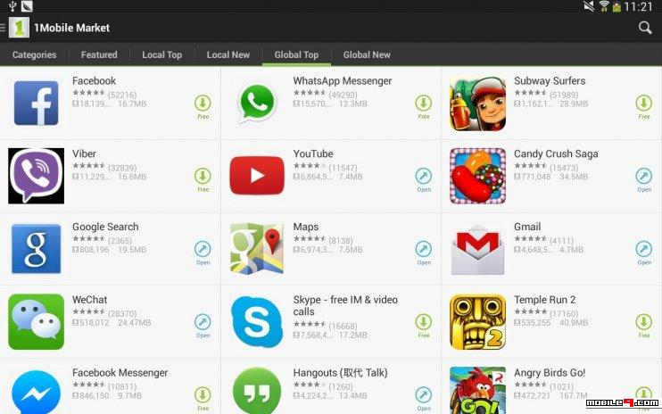

# Profitable App Profiles for the App Store and Google Play Markets

## Project Description.

We're working as data analysts for a company that builds free Android and free iOS mobile apps, our main source of revenue consists of in-app ads. This means that the number of users of our apps determines our revenue for any given app — the more users who see and engage with the ads, the better. 

Our goal for this project is to analyze data to help our developers understand what type of apps are likely to attract more users.

## Table of Contents.

 Collect and analyze data from each of the online stores to understand what type of apps are likely to attract more users is our main objective, for this we will need to take a series of steps.

 
### 1. Exploring data

### 2. Data cleaning 

### 3. Isolating Free Apps 

### 4. Most Popular Apps by Genre

### 5. Summary.

## Installation and libraries:

`python                    3.8.2`

In `conda_list.txt` are all the function libraries that I have used.
